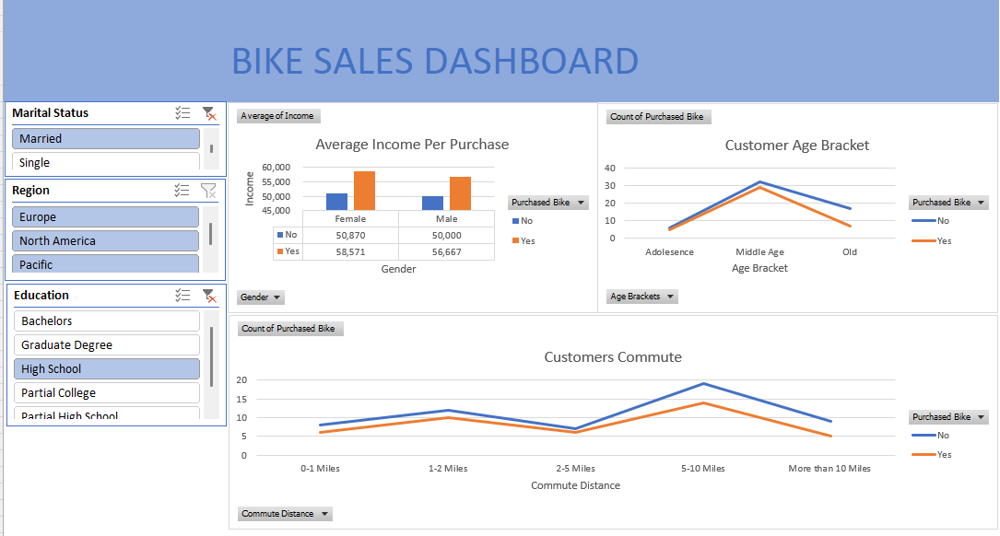

# Excel-Project
## Introduction
I came across this dataset online and admires how rich the data is as I have been trying to get my hands dirty with a a very rich dataset to practice my data 
cleaning, analysis and visualization skills in excel.
 
Disclaimer: All datasets and reports do not represent any company, institution or region, but just a dummy dataset to demonstrate capabilities of excel.
 
## Description
This dataset contains demographic, socioeconomic, and behavioral information about customers in an automobile company.

## Features
1. Marital Status: Information on whether the individual is married or single.
2. Gender: Indicates the gender of the individual.
3. Income: Represents the individual's income on an annual basis.
4. Children: The number of children each individual has.
5. Education: The level of education attained.
6. Occupation: Describes the individual's job or professional category.
7. Home Owner: Indicates whether the individual owns their home or not.
8. Cars: The number of cars owned by each individual.
9. Commute Distance: How far the individual commutes daily.
10. Region: The geographical location or region the individual resides.
11. Age: The exact age of the individual.
12. Age Brackets: Grouped individuals into according to age ranges.
13. Purchased Bike: A binary indicator or categorical variable showing whether the individual has purchased a bike.

## Problem Statement
1. What is the target demographic most likely to purchase a bike?
2. How do commute patterns influence the likelihood of bike purchases?
3. How do regional factors, like income distribution or commuting patterns, influence bike buying behavior?
4. Do certain regions have higher bike purchase rates compared to others?

## Skills/ concepts demonstrated:
The following Excel features were incorporated:Remove duplicate,Find and Replace,Currency format,Nested-if statement,commas-style,Decrease decimal,Pivot table,Pivot chart,Pivot design,slicers,Dashboard design.

## Visualization:
This report provides insights into customer behavior and demographics based on the following metrics:
1. Average Income Per Purchase: This metric calculates the average income of customers for each purchase, providing insights into purchasing power.
2. Customers' Commute: This metric evaluates the distance or mode of commute for customers, offering an understanding of how accessible the location is to them.
3. Customers' Age Bracket: This metric categorizes customers into age groups to analyze the distribution of different age demographics.

Slicers Used
To refine and segment the data, the following slicers were applied:
1. Marital Status: Filters the data based on whether customers are single, married, divorced, etc.
2. Region: Filters customers based on their geographic location or region.
3. Education: Filters customers based on their level of education, such as high school, bachelor's degree, master's degree, etc.

## How to Use the Report
1. Open the report  [Excel Project.xlsx] and navigate through the visuals for each metric.
2. Use the slicers to apply filters and view specific segments of the data.
Example: Use the "Region" slicer to analyze income per purchase for a specific area.

